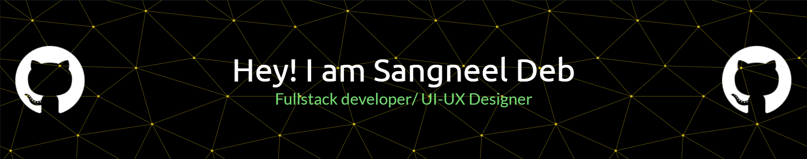

  

### Hi there 👋 I am Sangneel Deb
I'm a passionate Computer Science & Engineering undergrad with over 6 years of programming experience. I love building real-world solutions through code and have a strong interest in Java, Machine Learning, Web Development, and UI/UX Design. Whether it's crafting seamless user interfaces or designing intelligent systems, I enjoy turning ideas into impactful, working products. Currently, I'm focused on honing my skills, contributing to open-source, and exploring innovative ways to bridge technology with everyday problems.

## 🖊️Fun Facts
<table align="center">
  <tr>
    <td>
      <ul>
        <li>Currently I am working on something awesome. ✨</li>
        <li>I am into hackathons, CTFs, and tech projects. 🧑‍💻</li>
        <li>I am looking to collaborate on cool projects. ✌️</li>
      </ul>
    </td>
    <td>
      
    </td>
  </tr>
</table>

## 🌍Let's Connect

## 🔨My Tech Tools

   
   
## 🎖️My Holopin Badges

## 📊My Stats

  
  

 

  

<!-- 

  

 

   
   
&nbsp; 

 -->

### Thanks for having a look at my Github profile 🙏

